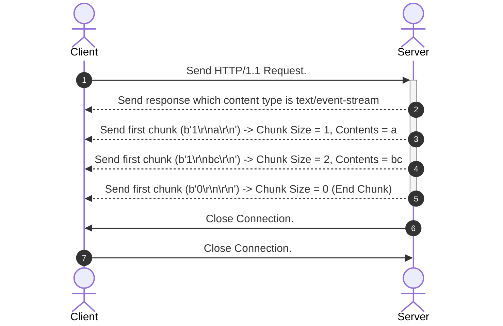

## Server Sent Event protocol
- SSE는 HTTP/1.1, HTTP/2 RFC에 명시된 프로토콜은 아니다.

### 응답 시, 필요한 것들
- 응답 헤더
  - Content-Type: text/event-stream
  - Transfer-Encoding: Chunked
- 응답 Chunk
  - `([CHUNK_SIZE:16진수]\r\n[CONTENTS]\r\n).encode()`

- 클라이언트는 서버에게 요청을 보냄. 
- 서버는 클라이언트에 `Content-Type: text/event-stream`을 응답함.
- 서버는 Connection을 닫지 않은 채, 클라이언트에게 Chunk 단위로 메세지를 전송.
  - Format은 다음과 같음 -> `<CHUNK_SIZE:16진수>\r\n<Encoded Contents>\r\n`
  - 더 이상 보낼 것이 없는 경우 -> `<0:16진수>\r\n\r\n`
- 서버 / 클라이언트는 커넥션을 닫는다.
