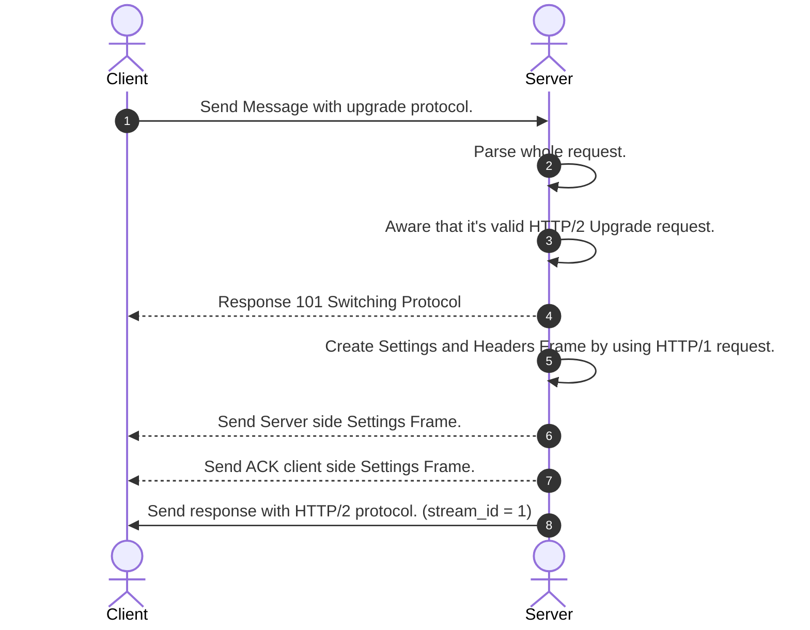

### Total Sequence Diagram

Client should send initial Settings Frame value in HTTP2-Settings with being encoded by base64. <br>
The server must receive all components of HTTP/1.1 in order to determine if a protocol change is necessary. <br>
Thus, Server already has SettingsFrame and HeadersFrame and DataFrame. <br> 

So, Server send a response with `101 Switching Protocol` and Server can convert HTTP/1.1 Header and Body to HTTP/2 HeadersFrame and DataFrame as well. <br> 
Then, Server will send a response with HeadersFrame which `stream_id` is 1.

### RFC
- https://datatracker.ietf.org/doc/html/rfc7540#section-3.2
```shell
     GET / HTTP/1.1
     Host: server.example.com
     Connection: Upgrade, HTTP2-Settings
     Upgrade: h2c
     HTTP2-Settings: <base64url encoding of HTTP/2 SETTINGS payload>
     
     
     ...
     HTTP/1.1 101 Switching Protocols
     Connection: Upgrade
     Upgrade: h2c

     [ HTTP/2 connection ...
```
