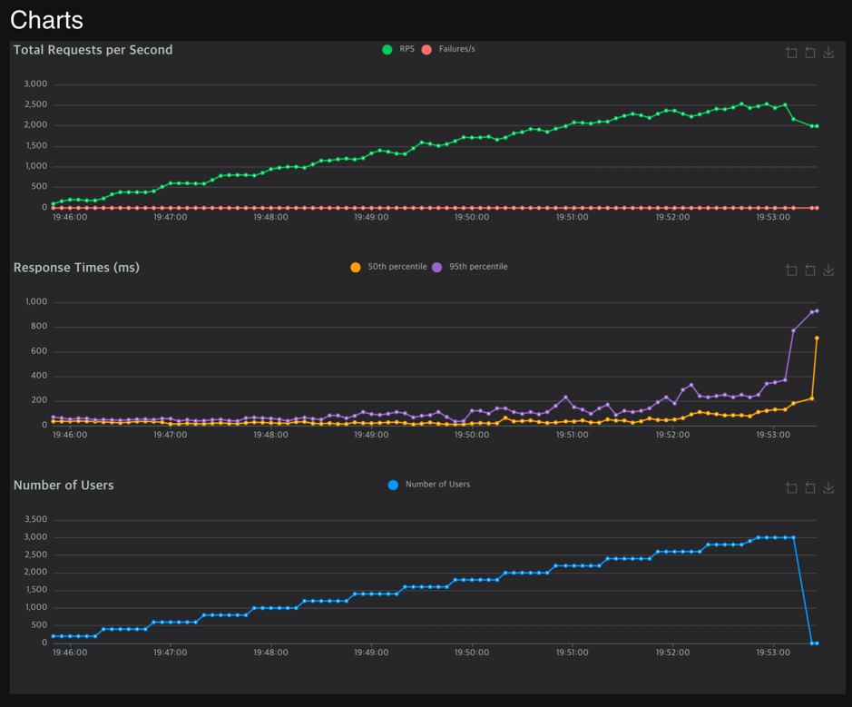
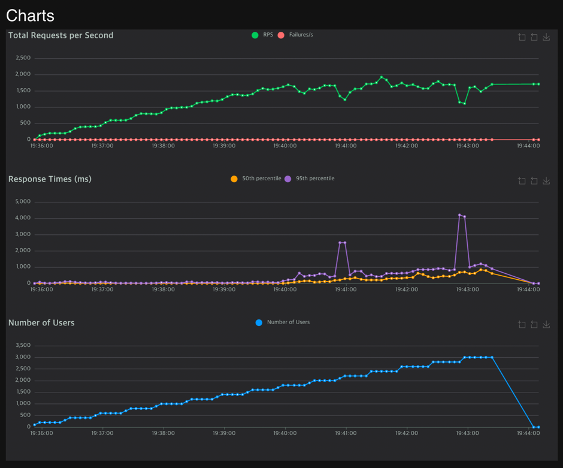

### Background
- FASTAPI
    - HTTP/1 : Uvicorn
    - HTTP/2 : Hypercorn
- Test Condition
    - Local M1 Mac.
    - Locust.
    - Using keep-alive.


### Test Result
- RPS

| Server Type   | Type | Name          | # Requests | # Fails | Average (ms) | Min (ms) | Max (ms) | Average size (bytes) | RPS    | Failures/s |
|---------------|------|---------------|------------|---------|--------------|----------|----------|----------------------|--------|------------|
| CUSTOM SERVER | GET  | /hello/ballo  | 659853     | 0       | 69.16        | 0        | 1189     | 1                    | 1461.36| 0          |
| FAST API      | GET  | /hello/ballo  | 552122     | 0       | 244.37       | 0        | 6732     | 1                    | 1220.07|            |


- Response Time

| Server Type   | Method | Name          | 50%ile (ms) | 60%ile (ms) | 70%ile (ms) | 80%ile (ms) | 90%ile (ms) | 95%ile (ms) | 99%ile (ms) | 100%ile (ms) |
|---------------|--------|---------------|-------------|-------------|-------------|-------------|-------------|-------------|-------------|--------------|
| CUSTOM SERVER | GET    | /hello/ballo  | 35          | 49          | 69          | 100         | 160         | 230         | 640         | 1200         |
| FAST API      | GET    | /hello/ballo  | 93          | 190         | 310         | 440         | 650         | 820         | 1300        | 6700         |


### Custom Server


### FAST API with Uvicorn



### Reference Server code (FastAPI with uvicorn)
```python
import uvicorn
from fastapi import FastAPI

app = FastAPI()

@app.get("/hello/ballo")
async def hello_ballo():
    return 1


if __name__ == '__main__':
    uvicorn.run("main:app", host="0.0.0.0", port=8081, reload=True)
```
