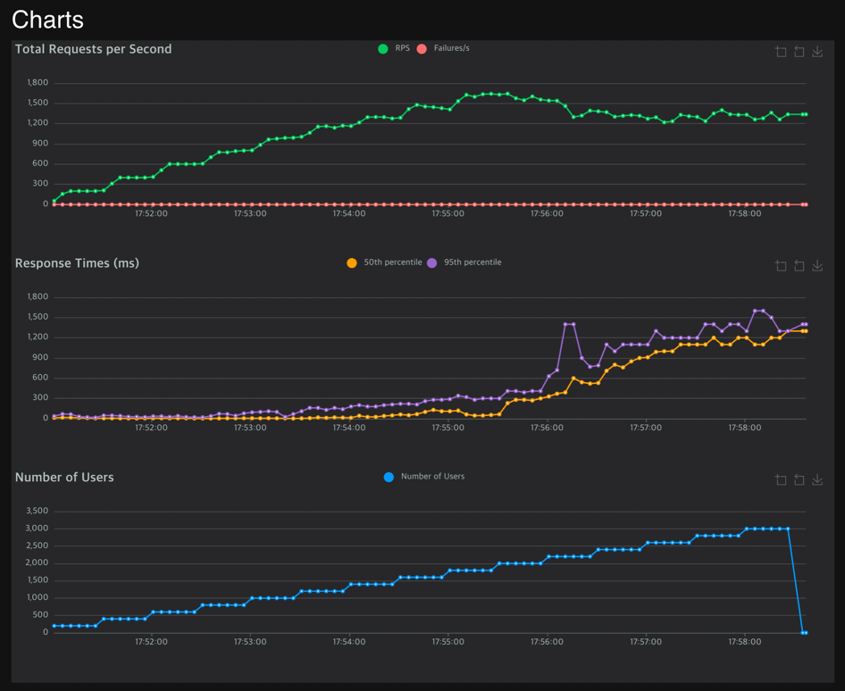

### Background
- FASTAPI
  - HTTP/1 : Uvicorn
  - HTTP/2 : Hypercorn
- Test Condition
  - Local M1 Mac
  - Locust with h2 client.
  - Under the multiflexing stream.


### Test Result
- RPS

| Server Type   | Type | Name          | # Requests | # Fails | Average (ms) | Min (ms) | Max (ms) | Average size (bytes) | RPS    | Failures/s |
|---------------|------|---------------|------------|---------|--------------|----------|----------|----------------------|--------|------------|
| Custom Server | GET  | /hello/ballo  | 705092     | 0       | 15.71        | 0        | 290      | 0                    | 1564.11| 0          |
| FAST API      | GET  | /hello/ballo  | 500745     | 0       | 429.87       | 0        | 3893     | 0                    | 1111.84| 0          |

- Response Time

| Server Type   | Method | Name          | 50%ile (ms) | 60%ile (ms) | 70%ile (ms) | 80%ile (ms) | 90%ile (ms) | 95%ile (ms) | 99%ile (ms) | 100%ile (ms) |
|---------------|--------|---------------|-------------|-------------|-------------|-------------|-------------|-------------|-------------|--------------|
| Custom Server | GET    | /hello/ballo  | 9           | 12          | 16          | 21          | 33          | 56          | 120         | 290          |
| FAST API      | GET    | /hello/ballo  | 200         | 360         | 730         | 960         | 1200        | 1300        | 1400        | 3900         |


### Custom Server


### FAST API with Hypercorn



### Reference Server code (FastAPI with hypercorn)
```python
import asyncio
from fastapi import FastAPI
from hypercorn.config import Config
from hypercorn.asyncio import serve

app = FastAPI()
timeout = Timeout(10.0, connect=5.0)

@app.get("/hello/ballo")
async def hello_ballo():
    return 1


if __name__ == "__main__":
    config = Config()
    config.bind = ["0.0.0.0:8081"]

    asyncio.run(serve(app, config))
```
