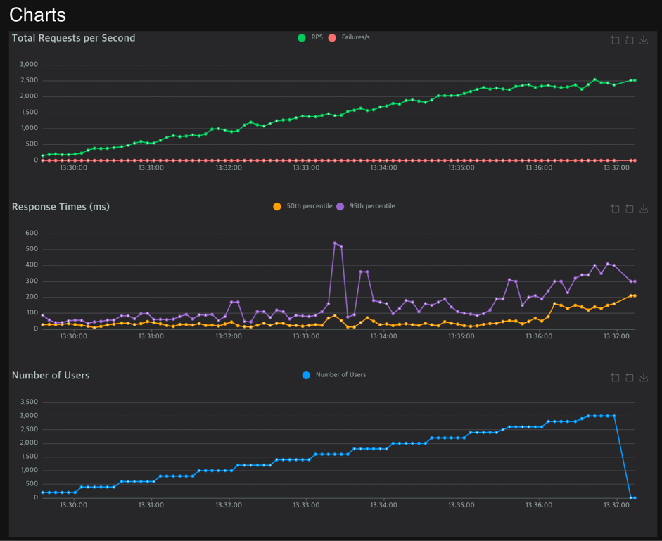
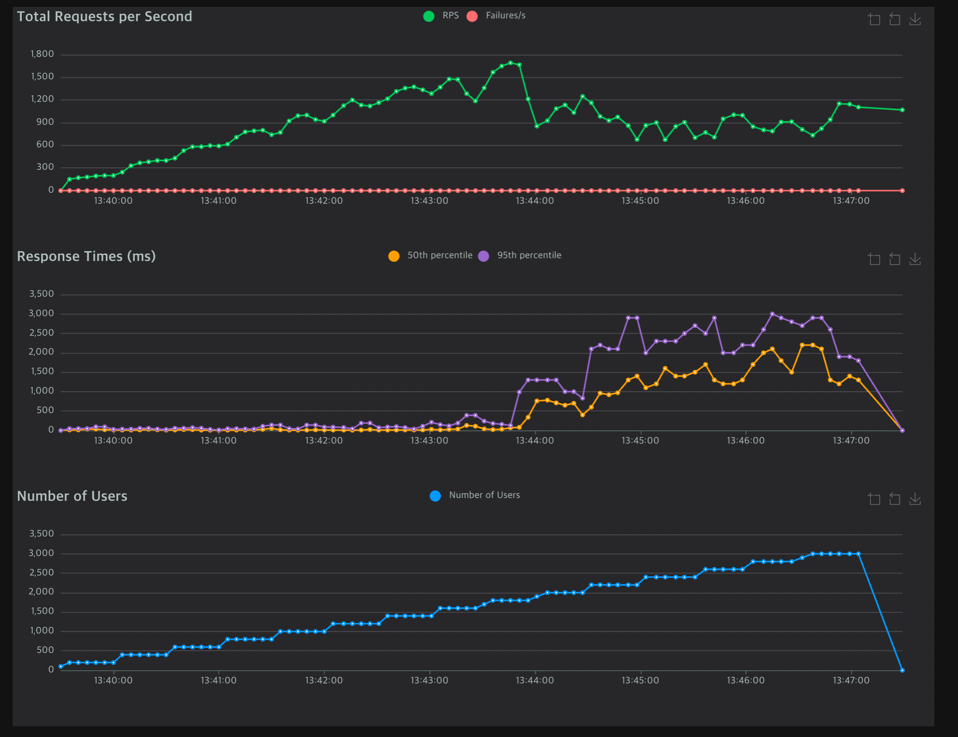
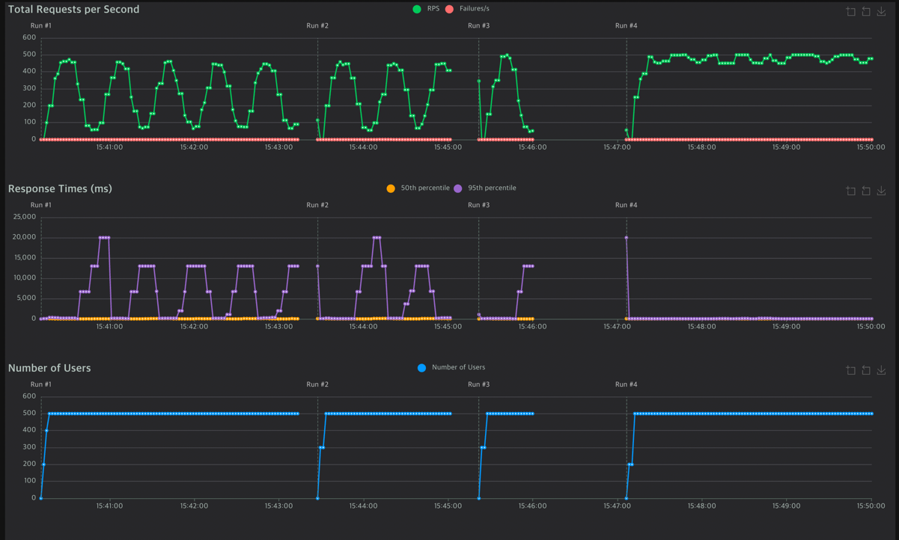

# Enviornment
- Mac M1  
- locust
- 

# Request
| Server        | Type        | Name         | # Requests | # Fails | Average (ms) | Min (ms) | Max (ms) | Average size (bytes) | RPS   | Failures/s |
|---------------|-------------|--------------|------------|---------|--------------|----------|----------|----------------------|-------|------------|
| FAST API      | GET         | /hello/ballo | 417475     | 1       | 591.25       | 0        | 10028    | 1                    | 917.52 | 0          |
| Custom Server | GET         | /hello/ballo | 655056     | 0       | 70.75        | 0        | 768      | 1                    | 1453.78 | 0          |

# Response
| Server Type  | Method | Name         | 50%ile (ms) | 60%ile (ms) | 70%ile (ms) | 80%ile (ms) | 90%ile (ms) | 95%ile (ms) | 99%ile (ms) | 100%ile (ms) |
|--------------|--------|--------------|-------------|-------------|-------------|-------------|-------------|-------------|-------------|--------------|
| FAST API     | GET     | /hello/ballo | 99          | 450         | 870         | 1300        | 1800        | 2200        | 2700        | 10000        |
| Custom Server| GET     | /hello/ballo | 41          | 58          | 82          | 120         | 180         | 220         | 380         | 770          |

# Custom Server 

# FAST API

# Problem

- KeepAlive가 정상적으로 구현되지 않았었음.
- #Run1 ~ #Run3: Keep-alive 비정상 구현.
- #Run4: Keep-alive 정상 구현
